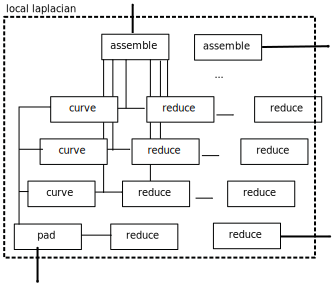
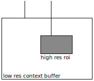

# pipeline setup

the pipeline is organised in layers. the first, user visible, layer is a graph
on modules. these have config params and can be arranged freely, and quickly
read from human readable or binary config files. the next layer is nodes
within each module. every module has at least one. a node will map directly
to a shader kernel, and its inputs and outputs will be managed by our memory
manager.

## modules

this is an example graph connecting a few modules, with multiple sinks and
multiple sources:

## nodes

this is one example for the local laplacian module which has particularly many
inner nodes:

TODO: image is incomplete. connections and number of reduce nodes depend on
configuration (contrast curve frequency might be hard coded, but resolution
determines number of levels in pyramids).

external connections are indicated as thick lines. these obviously take the
input to "pad" and the output from the last "assemble" stage. maybe not so
obviously it also has a connection to do tone manipulations for the coarsest
level.  this is useful for hdr images for instance, in this case.

note that in general it is more complicated than this: every external connection
can potentially come with a region of interest and a context buffer. that means
there will be two vulkan buffers associated with the connection.
TODO: simple gaussian blur with context buffer

## connections

a connection between modules carries an image buffer with all necessary
information. that is:

* geometry of the buffer (overall size, region of interest with scale)
* colour and encoding format information
* if the roi is not full size, there is an additional context buffer

in particular, the image may be transported as two buffers: *roi* and *context*:

it may not come in full for performance and memory reasons: when
developing the image zoomed in, not all of the image has to be processed.
when zoomed out, only a scaled down image may be sufficient.

However, some modules require multi-scale context to be able to correctly
render a roi. that comes in form of the *context* buffer which represents
the full image but scaled down to lower resolution.

a connection between low-level nodes corresponds exactly to one vulkan buffer
(encoded as offset and size in our heap allocation), as well as roi
information. this means the nodes can be mapped directly to glsl kernels.

on the module level, each connection has to carry context information. the
module is responsible to transfer such context from input to output connectors,
and potentially has to replicate the internal node structure. it can also
create cross connections between context buffers and nodes that are used to
process the roi buffer.
